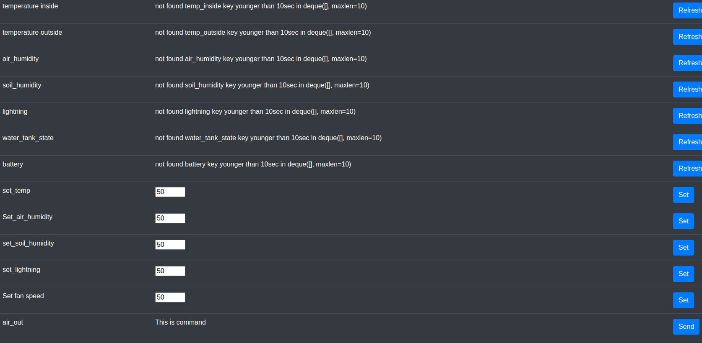
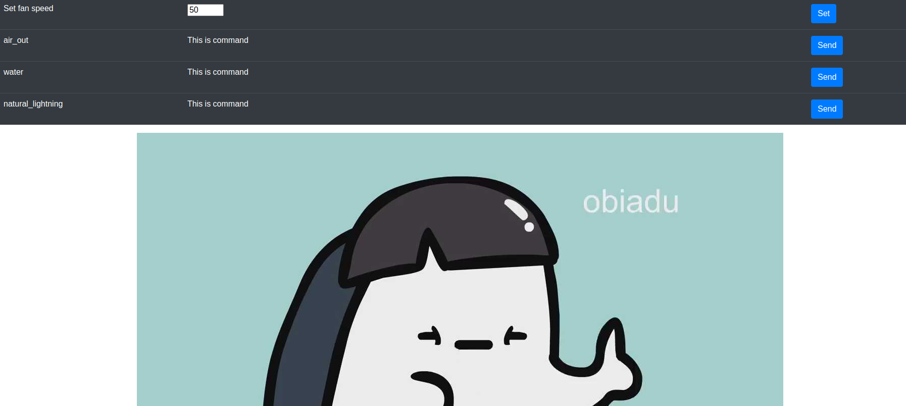

# run
Remember to plugin Camera
```
sudo docker pull 32233223/garden:latest
sudo docker run -p 8000:8000 -p 8081:8081 --device=/dev/video0 --device=/dev/ttyUSB0 -v $(pwd -- "$0")/src:/home/src -it 32233223/garden:latest
```
then checkout https://0.0.0.0:8000 and accept risk - login is admin pass is admin 
documentation in swageer style is on https://0.0.0.0:8000/docs 
if you want internet:
```
sudo apt install -y npm
sudo npm install -g localtunnel
```
and then in separate console for steering : 
```
lt --port 8000
```
and then in separate console for video url : 
```
lt --port 8081
```
docs on http://127.0.0.1:8000/docs
# run in dev mode
```
pip install -r requirements.txt
sudo apt install motion uvicorn -y
sudo motion -m -c src/camera0.conf -d 9 -k INFO
cd src && uvicorn main:app  --host 0.0.0.0 --port 8000 --reload --ssl-keyfile /etc/motion/motion.key --ssl-certfile /etc/motion/motion.crt
```

to have synthetic uart:
socat -d -d pty,raw,echo=0 pty,raw,echo=0
echo '{"temp_inside":3}' > /dev/pts/3
cat < /dev/pts/2
# run tests

cd src && pytest

# how it looks


